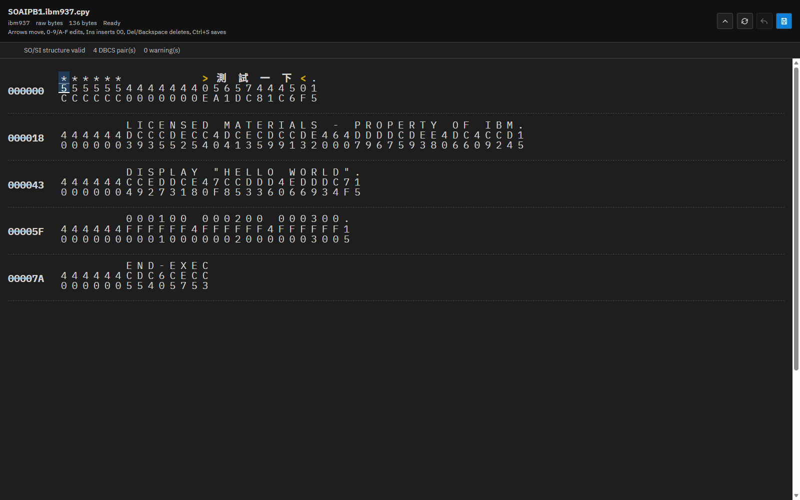
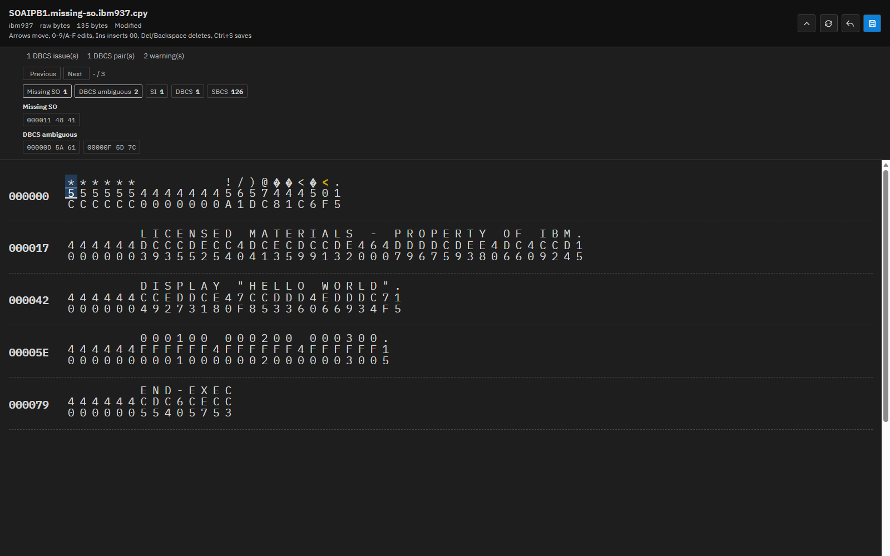
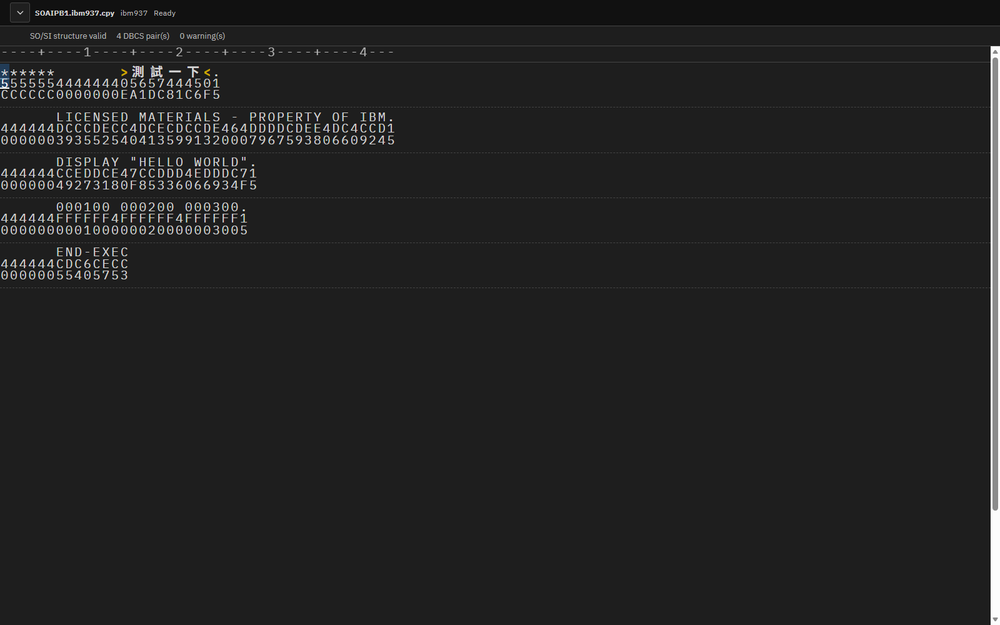

# IBM Z HEX ON Editor


IBM Z HEX ON Editor adds an ISPF-style byte editor to VS Code. Open a local file, choose the actual encoding of the bytes on disk, edit the high and low hex nibbles directly, and save the updated raw bytes back to the file.

The current MVP is focused on IBM EBCDIC and UTF-8 workflows. IBM-037, IBM-500, IBM-1047, and IBM-1140 files get SBCS preview support. IBM-930, IBM-933, IBM-935, IBM-937, IBM-939, IBM-1364, IBM-1371, IBM-1388, IBM-1390, and IBM-1399 files get SO/SI structure diagnostics for DBCS data so you can inspect, repair, and verify shift-byte problems without leaving VS Code.

## What You Can Do

- Open a local file in a HEX ON custom editor.
- View raw file bytes as editable high/low hex-nibble rows.
- See a read-only character preview decoded with the encoding you choose.
- Edit bytes by replacing nibbles, inserting `00`, or deleting bytes.
- Preview supported IBM EBCDIC SBCS and DBCS bytes as text.
- Inspect IBM EBCDIC DBCS SO/SI structure and DBCS ambiguity warnings.
- Jump from diagnostics to the exact byte location.
- Save edited bytes back to disk, then return to the default VS Code editor.
- Enable Condense Mode to show more bytes per row.
- Collapse the header and optionally show a column ruler above the byte grid.

## Screenshots

Screenshots for the current webview experience are captured below. The full capture list, filenames, and manual fixture setup are tracked in [docs/screenshots.md](docs/screenshots.md). Marketplace-ready listing copy is tracked in [docs/marketplace.md](docs/marketplace.md).







## Installation

### Install From VSIX

Build the package:

```sh
npm install
npm run package:vsix
```

Install `dist/ibm-z-hex-on-editor.vsix` from VS Code:

1. Open the Extensions view.
2. Run `Extensions: Install from VSIX...`.
3. Select `dist/ibm-z-hex-on-editor.vsix`.
4. Reload VS Code if prompted.

For repeatable validation with a clean VS Code profile, see [docs/acceptance-checklist.md](docs/acceptance-checklist.md).

### Run From Source

```sh
npm install
npm run compile
```

Open this repository in VS Code and press `F5` to launch an Extension Development Host.

## Basic Use

1. Open a local file in VS Code.
2. Run `IBM Z Hex Editor: Open HEX ON` from the Command Palette, editor title menu, or editor context menu.
3. If the current file has unsaved changes, save it first.
4. Choose the actual file-content encoding of the bytes on disk.
5. Edit bytes in the HEX ON view.
6. Press `Ctrl+S` or click `Save`.

Choose one of the supported IBM EBCDIC SBCS or DBCS encodings when the file bytes use that code page, even if VS Code previously displayed the file through another text encoding.

If you manually enter an IBM-style code page id that is not yet supported, the extension warns before opening. Raw byte editing still works, but preview, row splitting, and diagnostics fall back to generic behavior.

## Settings

- `ibmZHexEditor.maxFileSizeKb`: maximum local file size, in KB, that can be opened in the HEX ON editor.
- `ibmZHexEditor.condenseMode`: show a denser grid with narrower byte cells, hidden offsets, and no grid edge padding.
- `ibmZHexEditor.showRuler`: show a column ruler above the byte grid.
- `ibmZHexEditor.dbcsAmbiguousExclusionsEnabled`: use custom byte-pair exclusions for `DBCS_AMBIGUOUS` warnings.
- `ibmZHexEditor.dbcsAmbiguousExclusions`: byte-pair rules such as `{ "bytes": "40 40", "label": "EBCDIC spaces" }`. When custom exclusions are first enabled, the extension writes the default rules to user settings JSON for editing.

## Documentation

- [User guide](docs/user-guide.md)
- [IBM DBCS diagnostics rules](docs/diagnostics.md)
- [Code page architecture](docs/code-page-architecture.md)
- [Acceptance checklist](docs/acceptance-checklist.md)
- [Icon design notes](docs/icon-design.md)
- [Localization plan](docs/i18n.md)
- [Marketplace listing draft](docs/marketplace.md)
- [Screenshot plan](docs/screenshots.md)
- [Change log](CHANGELOG.md)
- [Roadmap](docs/roadmap.md)

## Current Limits

- Local files only.
- IBM-037, IBM-500, IBM-1047, and IBM-1140 have SBCS preview support but no DBCS diagnostics.
- IBM-930, IBM-933, IBM-935, IBM-937, IBM-939, IBM-1364, IBM-1371, IBM-1388, IBM-1390, and IBM-1399 have SO/SI DBCS diagnostics.
- Additional IBM EBCDIC SBCS or DBCS code pages can be added through the generated-table workflow after fixtures and tests are available.
- Localization infrastructure is in place with English baseline strings; translated catalogs are planned after UI text and diagnostics wording settle.

## Development Verification

```sh
npm run type-check
npm test
npm run package:vsix
```
